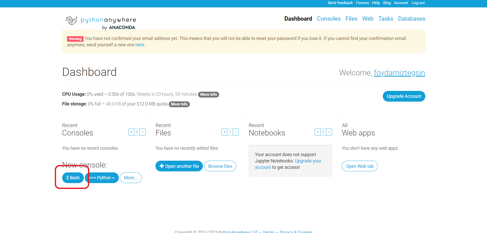
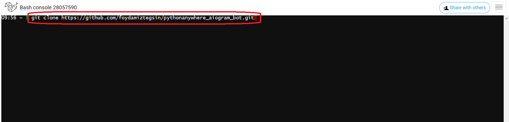
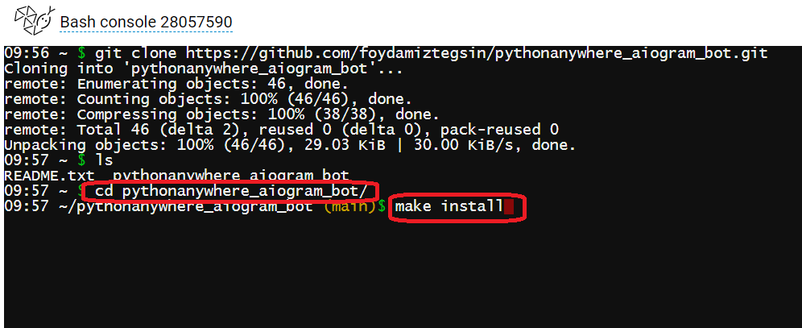
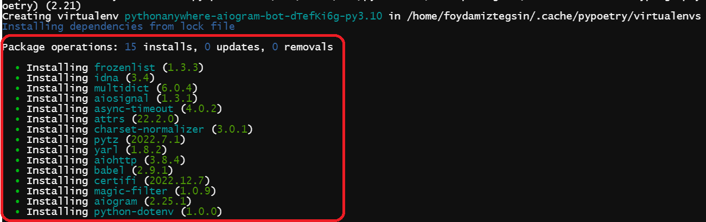
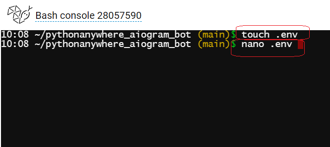

# aiogram-bot-shablon
Telegramda  aiogram  orqali  bot tuzish uchun shablon

 
 

Fikr  va  mulohazalar uchun [Dasturlash bo'yicha  Foydamiz Tegsin!](https://t.me/foydamizteg_sin)

# Loyihani  yuklash

> *$Bash*
 

> *Loyihani  clon qiling*
 

> *Loyihani  papkasiga kiring va __make install__*
 

> *Rasmdagi  holat kuzatilishiga e'tibor bering*
 

> *Shu yerda(loyiha papkasini ichida) .env fayl yarating va faylga yozish uchun nano .env buyrug'ini bering*
 

